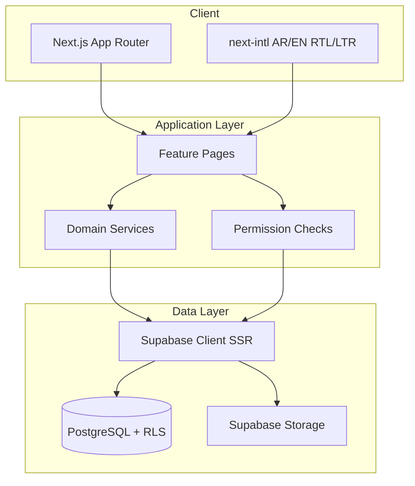

# Architecture

## System architecture

## Modular feature layout

| Module | Path | Responsibility |
|--------|------|----------------|
| Identity | `src/domain/auth` | Roles, permissions, segregation checks |
| Financial | `src/domain/financial` | EV, EAC, VAT, variance formulas |
| Organization | DB + future services | OBS hierarchy |
| Budgets | DB + UI routes | Versions, lines, monthly allocations |
| Projects | DB + UI routes | WBS, milestones, schedule baselines |
| Actuals | DB + imports | Immutable source + allocations |
| Dashboards | `src/app/[locale]/dashboard` | Seed/DB-backed KPIs |

## Security model

- Deny-by-default RLS on exposed tables
- Server-side permission checks mirror UI capabilities
- Posted financial records: no UPDATE/DELETE; reversals only
- Audit events append-only

See [DECISIONS.md](./DECISIONS.md) and [SECURITY_REVIEW.md](./SECURITY_REVIEW.md).
