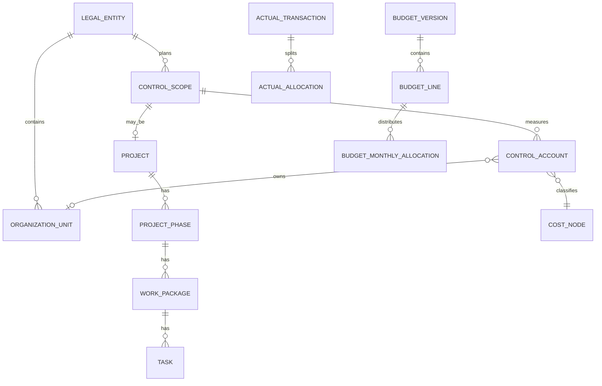
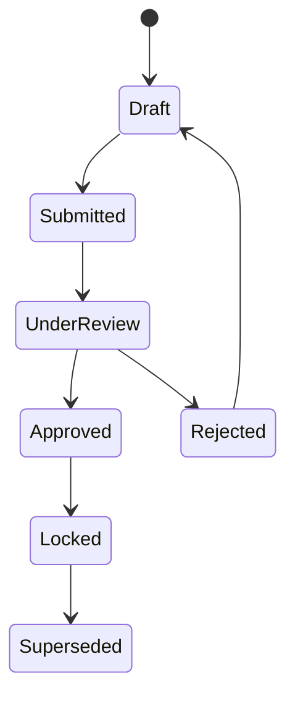

# Domain Model

## Independent dimensions

The platform combines dimensions in reports rather than forcing a single hierarchy:

| Dimension | Purpose |
|-----------|---------|
| Organizational Breakdown (OBS) | Who is responsible |
| Cost Breakdown (CBS) | Nature of cost/revenue |
| Work Breakdown (WBS) | What work is performed |
| Time | Financial periods, schedule dates |
| Control Scope | Universal planning object |
| Control Account | Primary measurement node |

## Entity relationships

## Control scope types

Operational budgets, projects, programs, capital initiatives, department plans, restaurant openings, annual business plans, cost-reduction and revenue plans.

## Budget lifecycle

Approved financial history is immutable; changes create new version records or change-request lines with before/after values.
